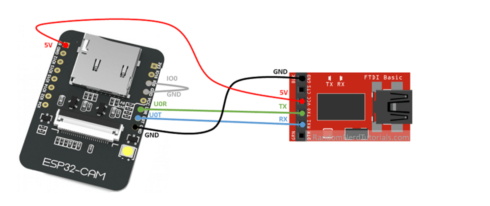
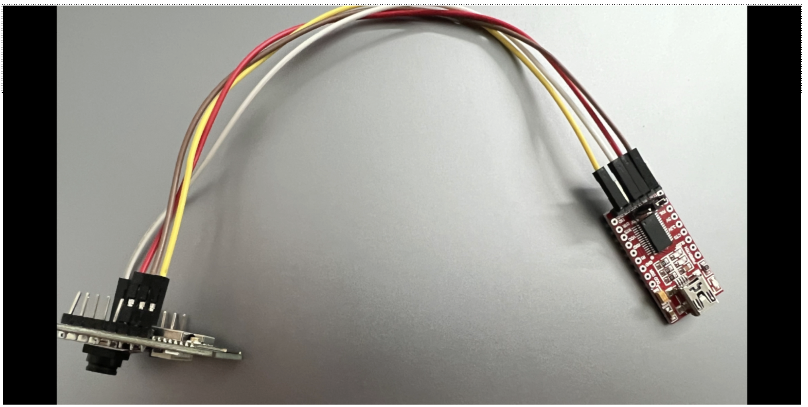

# Periodic Mail Box Checker - Group 19

Using the ESP32CAM to take the snapshot of mailbox every 12 hours and send it to a firebase(google cloud storage). 

## Group Members

- **Anurag Bansal(19114010)**
- **Aditya rai(19114004)**

## Setup and Instructions

The code is contained in `src/PeriodicMailBoxChecker/PeriodicMailBoxChecker.ino`.

1. First we need the basic connections between the FTDI programmer and ESP32CAM for programming the module as shown below.


<br>

2. In order to run the code the Wifi username and password need to be provided. These variables are defined as the following in the code base.
```
const char* ssid = "";
const char* password = "";
```

3. We have integrated the project with `Firebase`, therefore we have hardcoded the `API_KEY, USER_EMAIL, USER_PASSWORD, STORAGE_BUCKET_ID` required for authentication but these can be changed as per your firebase project configuration.
```
#define API_KEY ""
#define USER_EMAIL ""
#define USER_PASSWORD ""
#define STORAGE_BUCKET_ID ""
```

4. For serial monitoring the ESP32CAM we need to remove connections between `IO0` and `GND` pins and click the `RST` button on the ESP32CAM module.


## Monitoring

For monitoring we have designed a `Ubidots Dashboard` for viewing the snapshots over time https://industrial.ubidots.com/app/dashboards/643eafdcf27c27000d19a34b.

The images are ordered from the latest to the oldest.

## Demo Video

[](media/IOT_Project_Demo.gif "Demo")


## Learnings

We learned about the difference between `SPIFFS` and `EEPROM`. 

As compared to `EEPROM`, `SPIFFS` is larger in storage capacity and wear-leveled. Also it has a lot of convenience features in terms of accessing data, and it lets you write or compose complex data.

`EEPROM` on the otherhand is tiny and has a limitation on how many times it can be committed (i.e how many times the data can be written at a strech in a time interval) before it fails ( as a result it is bad for datalogging and stuff). It does not offer writing complex data.

Both are non-volatile form of storage, whereas SPIFFS is used for storing large files and complex data, EEPROM only stores simple data and small memory blocks.

## Firebase Setup

This article https://medium.com/@nschairer/flask-api-authentication-with-firebase-9affc7b64715 can be referred for setting up `Firebase` with `ESP32CAM` for getting `API_KEY, USER_EMAIL, USER_PASSWORD, STORAGE_BUCKET_ID`.
